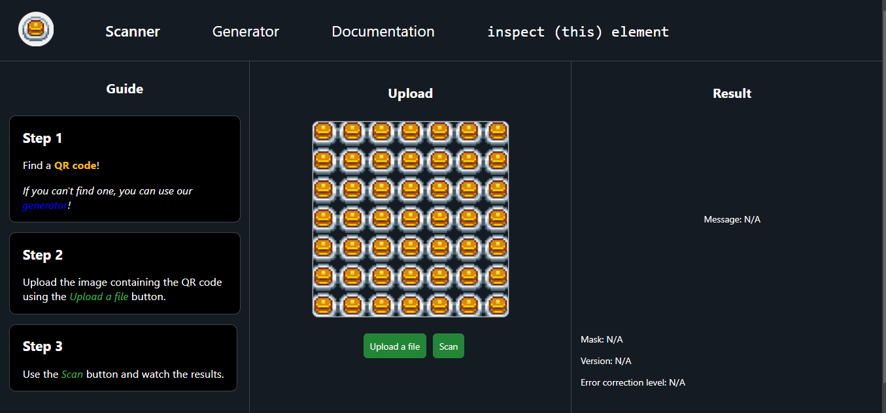

# QR-Code-Generator-Scanner
Team project ~ CSA ~ Year I / Informatics Bachelor's Degree / Faculty of Mathematics and Informatics - University of Bucharest

## **Informații generale**

Această aplicație pune la dispoziție o soluție completă pentru encodarea și decodarea codurilor QR.

- **Backend**: C#
- **Frontend**: [Website](https://vlaxcs.github.io/QR-Code-Generator-Scanner/) - HTML, CSS, JavaScript

## **Specificațiile unui cod QR**

| Informații auxiliare     |   Specificații                            |
|--------------------------|-------------------------------------------|  
| **Tipul encodării**      | **Numeric / Alphanumeric / Byte / Kanji**  |  
| **Versiunea codului QR** | Un număr între 1 și 40, în funcție de dimensiunea datelor |  
| **Masca aplicată**       | Un număr de la 1 la 7, specific unui pattern anume |  
| **Procese intermediare** | Informații despre erori ce nu pot fi tratate |  

## **Scanner**

### Interfața pentru utilizator

Disponibilă la adresa: https://vlaxcs.github.io/QR-Code-Generator-Scanner


### Date de intrare

- **Un fișier PNG** care conține un cod QR
- **Versiunea codului QR** (dacă nu este furnizată, se stabilește în funcție de dimensiunea input-ului)
- **Nivel de corectare a erorilor** (dacă nu este furnizat, se stabilește unul corespunzător)

### Prelucrarea datelor
Pasul I. <i>Crearea unei matrice binare pe baza imaginii primite (și alocarea acesteia prin constructor)</i>

```
var code = QRCodeImageParser.Parse(@"filepath");
```

- Clasa `QRCodeImageParser` conține metoda `Parse`, în care:
    - `DetermineBounds` elimină surplusul de informație din imagine, astfel încât singura informație prelucrată să fie exclusiv codul QR. Acest procecedeu se datorează diferențelor de luminanță din imagine.
    - `DeterminePixelSize` calculează dimensiunea unui pixel, prin două parcurgeri, una pe diagonala principală, iar cealaltă pe diagonala principală. La final, cele două rezultate sunt aproximate și se obține dimensiunea corectă a unui pixel.
    - `ExtractJaggedArray` calculează matricea binară care conține toate datele din codul QR. Aceasta este prelucrată ulterior pentru a stabili specificațiile și pentru a obține mesajul final.
    - `CheckOrientation` verifică orientarea codului QR. Dacă acesta nu este în poziția favorabilă prelucrării, este întors. Orientarea este determinată de poziția celor 3 pătrate din colțuri. Ne dorim ca ele să fie în Nord-Vest, Sud-Vest și Sud-Est.
    - <i>Matricea binară este trimisă la prelucrare ulterior acestor procese</i>.

Pasul II. <i>Stabilirea specficiațiilor codului QR</i>

Constructorul `QRCode` creează un obiect, despre care sunt cunoscute:
- Versiunea (codului QR), determinată de dimensiunile matricii binare.
- `Initialize` aplică măști pentru a determina informații despre codul QR (versiunea și nivelul de Erorr Correction), dispuse precum în imagine:  Cele două linii trebuie să fie identice. În cazul în care acestea nu sunt, programul se va opri.

### Corectitudinea datelor

- Error correction blocks
- Reed Solomon (referențiere bibliotecă python)

### Date de ieșire


## **Generator**


## Referințe
1. https://en.wikipedia.org/wiki/Reed%E2%80%93Solomon_error_correction#MATLAB_example
