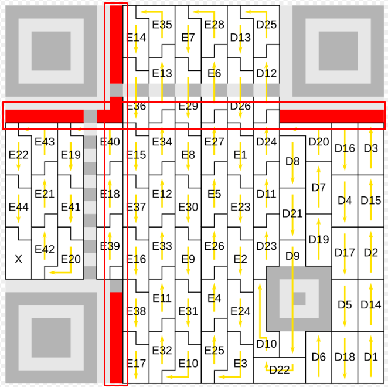

# QR-Code-Generator-Scanner
Team project ~ CSA ~ Year I / Informatics Bachelor's Degree / Faculty of Mathematics and Informatics - University of Bucharest

## **Informații generale**

Această aplicație pune la dispoziție o soluție completă pentru encodarea și decodarea codurilor QR.

- **Backend**: C#
- **Frontend**: [Website](https://vlaxcs.github.io/QR-Code-Generator-Scanner/) - HTML, CSS, JavaScript

## **Specificațiile unui cod QR**

| Informații auxiliare     |   Specificații                            |
|--------------------------|-------------------------------------------|  
| **Tipul encodării**      | **Numeric / Alphanumeric / Byte / Kanji**  |  
| **Versiunea codului QR** | Un număr între 1 și 40, în funcție de dimensiunea datelor |  
| **Masca aplicată**       | Un număr de la 0 la 7, specific unui pattern anume |  
| **Procese intermediare** | Informații despre erori ce nu pot fi tratate |  

## **Scanner**

### Interfața pentru utilizator

Disponibilă la adresa: https://vlaxcs.github.io/QR-Code-Generator-Scanner


### Date de intrare

- **Un fișier PNG** care conține un cod QR

### Prelucrarea datelor
Pasul I. <i>Crearea unei matrice binare pe baza imaginii primite (și alocarea acesteia prin constructor)</i>

```
var code = QRCodeImageParser.Parse(@"filepath");
```

- Clasa `QRCodeImageParser` conține metoda `Parse`, în care:
    - `DetermineBounds` elimină surplusul de informație din imagine, astfel încât singura informație prelucrată să fie exclusiv codul QR. Acest procecedeu se datorează diferențelor de luminanță din imagine.
    - `DeterminePixelSize` calculează dimensiunea unui pixel, prin două parcurgeri, una pe diagonala principală, iar cealaltă pe diagonala principală. La final, cele două rezultate sunt aproximate și se obține dimensiunea corectă a unui pixel.
    - `ExtractJaggedArray` calculează matricea binară care conține toate datele din codul QR. Aceasta este prelucrată ulterior pentru a stabili specificațiile și pentru a obține mesajul final.
    - `CheckOrientation` verifică orientarea codului QR. Dacă acesta nu este în poziția favorabilă prelucrării, este întors. Orientarea este determinată de poziția celor 3 pătrate din colțuri. Ne dorim ca ele să fie în Nord-Vest, Sud-Vest și Sud-Est.
    - <i>Matricea binară este trimisă la prelucrare ulterior acestor procese</i>.

Constructorul `QRCode` creează un obiect, despre care sunt cunoscute:
- Versiunea (codului QR), determinată de dimensiunile matricii binare.
- `Initialize` aplică măști pentru a determina informații despre codul QR (versiunea și nivelul de Erorr Correction), dispuse precum în imagine:  Cele două linii trebuie să fie identice. În cazul în care acestea nu sunt, programul se va opri.

### Corectitudinea datelor

- Error correction blocks
- Reed Solomon (referențiere bibliotecă python)

### Date de ieșire
- Afiseaza informatiile din codul qr
- Versiune Folosita
- Nivelul de error correction folosit

## **Generator**

### Date de intrare

- **Textul** pe care vrei sa il contina codul QR
- **Versiunea minima codului QR** (dacă nu este furnizat, se stabilește una corespunzătoare)
- **Nivel de corectare a erorilor** 

### Prelucrarea datelor
- Functia `Generate` Generează codul QR complet, incluzând blocurile de date și corectarea erorilor.
  Configurarea versiunii și nivelului de corectare a erorii.
    - `PutStripes` Plasează pixeli alternând între alb și negru pe linia și coloana 6.
Aceste "stripes" ajută la detectarea și alinierea corectă a codului QR de către cititoare.
    - `PutMaskBits` Aplică masca QR, care optimizează distribuția pixelilor pentru a preveni interferențele la citirea codului QR.
Masca este aplicată pe blocurile de orientare pentru a spori acuratețea codului.
    - `SetAllDataBlocks` Plasează blocurile de date și blocurile de corectare a erorilor în matricea QR.
Blocurile de date conțin informațiile reale, iar blocurile de corectare a erorilor ajută la recuperarea acestora în cazul unor erori de citire.
    - `ApplyVersionBits` Dacă versiunea codului QR este 6 sau mai mare, această funcție adaugă biți de informații pentru versiune.
Acești biți sunt necesari pentru a asigura corectitudinea citirii pentru versiunile mai mari ale codului QR.
    - `PlaceBestMask` Alege cea mai bună mască dintre cele 8 opțiuni posibile.
Masca optimă asigură o distribuție uniformă a pixelilor, minimizând erorile de citire.
Pasul II. <i>Stabilirea specficiațiilor codului QR</i>
### **Message Encoder**
Transforma un string intr-un sir de biti dupa o anumita encodare (numeric/alphanumeric/byte/kanji):<br>
_Nu avem suport pentru Kanji_<br>
Este spart in cate un encoder pentru fiecare tip: `NumericEncoder`, `AlphanumericEncoder`, `ByteEncoder`.

Fiecare encoder se ocupa sa transforme stringul de mesaj in conformitate cu formatul fiecaruia:
- Numeric: Encodeaza cate 3 cifre pe 11 biti
- Alphanumeric: Encodeaza cate 2 caractere pe 10 biti
- Byte: Encodeaza cate un caracter pe 8 biti


Toate encoderele returneaza un `QREncodedMessage` care contine sirul de biti de mesaj.

### Corectitudinea datelor

- Error correction blocks
- Reed Solomon <sup>[1](#Referințe)</sup>

### Date de ieșire
- O imagine cu codul QR
- Versiune Folosita
- Nivelul de error correction folosit


## Referințe
0. https://en.wikipedia.org/wiki/QR_code
1. https://en.wikipedia.org/wiki/Reed%E2%80%93Solomon_error_correction#MATLAB_example
2. https://www.thonky.com/qr-code-tutorial/error-correction-table
3. https://blog.qartis.com/decoding-small-qr-codes-by-hand/
4. https://www.nayuki.io/page/creating-a-qr-code-step-by-step
